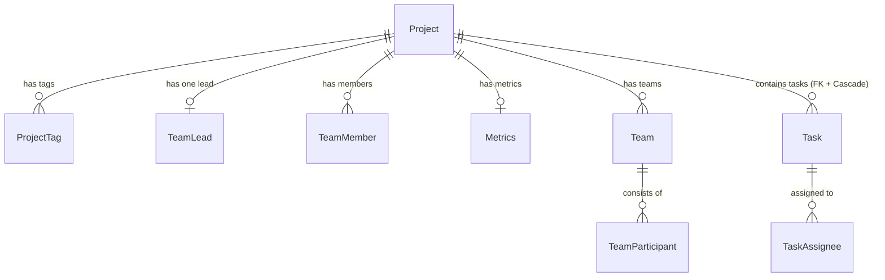
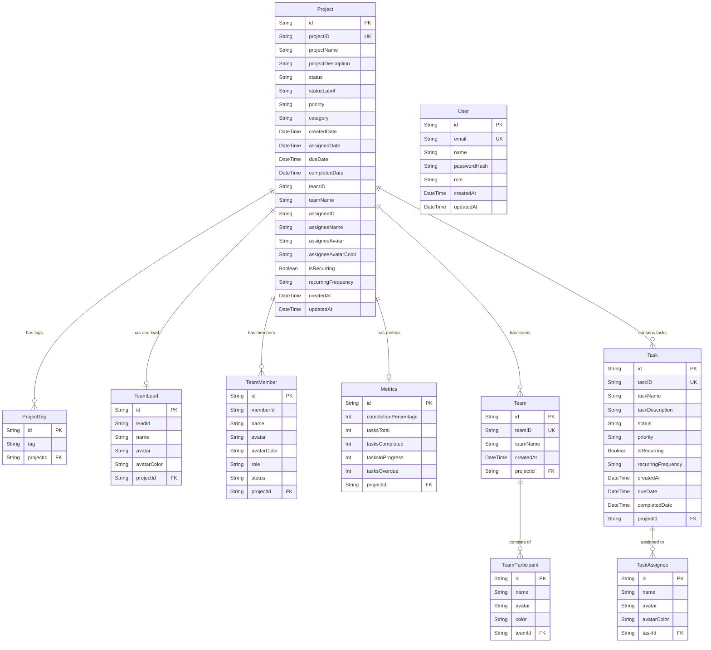
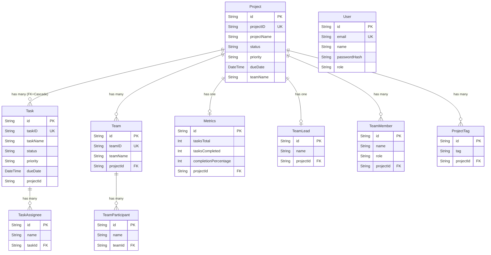

# FlowDesk — Database Documentation

> Last updated: **March 26, 2026**  
> Current schema version: `20260326102836_add_users_table`

---

## 1. Database Stack

| Property | Value |
|---|---|
| **Database Engine** | **PostgreSQL 18.3** (local server — `localhost:5432`) |
| **Database Name** | `flowdesk` |
| **ORM** | **Prisma ORM** (v7) |
| **Prisma Adapter** | `@prisma/adapter-pg` (PrismaPg) |
| **Prisma Client** | `prisma-client-js` |
| **Schema File** | `backend/prisma/schema.prisma` |
| **Prisma Config** | `backend/prisma.config.ts` (holds datasource URL — Prisma v7 pattern) |
| **Migrations Folder** | `backend/prisma/migrations/` |
| **Total Tables** | **10** |
| **Total Migrations Applied** | **3** |

### Environment Variables (backend/.env)

| Variable | Purpose |
|---|---|
| `DATABASE_URL` | Full PostgreSQL connection string (used by Prisma migrations) |
| `DB_HOST` | Database host (default: `localhost`) |
| `DB_PORT` | Database port (default: `5432`) |
| `DB_NAME` | Database name (`flowdesk`) |
| `DB_USER` | Database user (`postgres`) |
| `DB_PASSWORD` | Database password |
| `JWT_SECRET` | Secret key for JWT token signing |
| `FRONTEND_URL` | Allowed CORS origin |
| `PORT` | NestJS server port (default: `3001`) |

> PostgreSQL runs as a local service on Windows. Prisma generates type-safe database clients from the schema, handles migrations, and prevents raw SQL errors.

---

## 2. Migration History

> ⚠️ Old SQLite migrations (4) were deleted when migrating to PostgreSQL. Fresh PostgreSQL migrations started March 26, 2026.

| # | Migration ID | What Changed |
|---|---|---|
| 1 | `20260326100451_init` | Full initial schema — all 9 tables created in PostgreSQL (`projects`, `tasks`, `teams`, `users` excluded — all core tables) |
| 2 | `20260326101935_add_indexes_and_task_fk` | Added `@@index` on `Project(status, priority, teamID)`, `Task(projectId, status, dueDate)`; added proper FK relation `Task.projectId → Project.id` with Cascade Delete |
| 3 | `20260326102836_add_users_table` | Added `users` table for JWT authentication (email, passwordHash, role, name) |

---

## 3. ER Diagram — High Level (No Columns)



---

## 4. ER Diagram — Detailed (With All Columns & Keys)



---

## 5. Table-by-Table Description

### `projects` — Core Entity
Central table. Every feature links back to a project.

| Column | Type | Nullable | Notes |
|---|---|---|---|
| `id` | TEXT (UUID) | No | Primary Key, auto-generated |
| `projectID` | TEXT | No | Unique human-readable ID e.g. `PRJ-001` |
| `projectName` | TEXT | No | Display name |
| `projectDescription` | TEXT | Yes | Optional description |
| `status` | TEXT | No | `todo` / `in-progress` / `completed` / `overdue` |
| `statusLabel` | TEXT | No | Display label e.g. `In Progress` |
| `priority` | TEXT | No | `critical` / `medium` / `low` |
| `category` | TEXT | No | e.g. `General`, `Design` |
| `createdDate` | DATETIME | No | Auto set on creation |
| `assignedDate` | DATETIME | No | When project was assigned |
| `dueDate` | DATETIME | **Yes** | Optional deadline (nullable) |
| `completedDate` | DATETIME | Yes | Set when status = completed |
| `teamID` | TEXT | No | Reference to team (denormalized) |
| `teamName` | TEXT | No | Display name of team |
| `assigneeID` | TEXT | No | ID of primary assignee |
| `assigneeName` | TEXT | No | Name of primary assignee |
| `assigneeAvatar` | TEXT | No | Avatar initials e.g. `RK` |
| `assigneeAvatarColor` | TEXT | No | Hex color e.g. `#4361ee` |
| `isRecurring` | BOOLEAN | No | Default: `false` |
| `recurringFrequency` | TEXT | Yes | `Daily` / `Weekly` / `Monthly` |
| `createdAt` | DATETIME | No | Auto timestamp |
| `updatedAt` | DATETIME | No | Auto-updated on every change |

---

### `project_tags` — Tags per Project
Many tags can belong to one project.

| Column | Type | Notes |
|---|---|---|
| `id` | UUID (PK) | Auto-generated |
| `tag` | TEXT | e.g. `Design`, `Urgent` |
| `projectId` | FK → `projects.id` | Cascade Delete |

---

### `team_leads` — Project Team Lead
Each project has **exactly one** team lead (1:1).

| Column | Type | Notes |
|---|---|---|
| `id` | UUID (PK) | Auto-generated |
| `leadId` | TEXT | e.g. `USER-001` |
| `name` | TEXT | Display name |
| `avatar` | TEXT | Initials e.g. `YU` |
| `avatarColor` | TEXT | Hex color |
| `projectId` | FK → `projects.id` (Unique) | Cascade Delete |

---

### `team_members` — Project Team Members
Each project can have **many** members with assigned roles.

| Column | Type | Notes |
|---|---|---|
| `id` | UUID (PK) | Auto-generated |
| `memberId` | TEXT | e.g. `USER-002` |
| `name` | TEXT | e.g. `Rahul Kumar` |
| `avatar` | TEXT | Initials e.g. `RK` |
| `avatarColor` | TEXT | Hex color |
| `role` | TEXT | `Owner` / `Team Member` |
| `status` | TEXT | `online` / `offline` (default: `online`) |
| `projectId` | FK → `projects.id` | Cascade Delete |

---

### `metrics` — Project Progress Metrics
Tracks live task completion stats for a project (1:1).

| Column | Type | Notes |
|---|---|---|
| `id` | UUID (PK) | Auto-generated |
| `completionPercentage` | INT | Default: 0 |
| `tasksTotal` | INT | Default: 0 |
| `tasksCompleted` | INT | Default: 0 |
| `tasksInProgress` | INT | Default: 0 |
| `tasksOverdue` | INT | Default: 0 |
| `projectId` | FK → `projects.id` (Unique) | Cascade Delete |

---

### `users` — Authentication
Stores registered users for JWT-based authentication.

| Column | Type | Nullable | Notes |
|---|---|---|---|
| `id` | UUID (PK) | No | Auto-generated |
| `email` | TEXT (Unique) | No | Login email, indexed |
| `name` | TEXT | No | Display name |
| `passwordHash` | TEXT | No | bcrypt hash (salt=10) |
| `role` | TEXT | No | `admin` / `member` (default: `member`) |
| `createdAt` | DATETIME | No | Auto timestamp |
| `updatedAt` | DATETIME | No | Auto-updated |

---

### `tasks` — Tasks within a Project
Each task is linked to a project via a **proper Prisma FK relation** with Cascade Delete (added in migration 2).

| Column | Type | Notes |
|---|---|---|
| `id` | UUID (PK) | Auto-generated |
| `taskID` | TEXT (Unique) | e.g. `TASK-101` |
| `taskName` | TEXT | Display name |
| `taskDescription` | TEXT | Optional |
| `status` | TEXT | `todo` / `in-progress` / `completed` / `overdue` — **indexed** |
| `priority` | TEXT | `critical` / `medium` / `low` |
| `isRecurring` | BOOLEAN | Default: false |
| `recurringFrequency` | TEXT | `Daily` / `Weekly` etc. |
| `createdAt` | DATETIME | Auto timestamp |
| `dueDate` | DATETIME | Required — **indexed** |
| `completedDate` | DATETIME | Optional |
| `projectId` | FK → `projects.id` | Cascade Delete — **indexed** |

---

### `task_assignees` — Task Assignees
Each task can have multiple assignees.

| Column | Type | Notes |
|---|---|---|
| `id` | UUID (PK) | Auto-generated |
| `name` | TEXT | Assignee name |
| `avatar` | TEXT | Default: empty |
| `avatarColor` | TEXT | Default: `#4361ee` |
| `taskId` | FK → `tasks.id` | Cascade Delete |

---

### `teams` — Named Teams per Project
A project can contain multiple named teams (e.g. `Backend Core Team`).

| Column | Type | Notes |
|---|---|---|
| `id` | UUID (PK) | Auto-generated |
| `teamID` | TEXT (Unique) | e.g. `BCT-001` |
| `teamName` | TEXT | Display name |
| `createdAt` | DATETIME | Auto timestamp |
| `projectId` | FK → `projects.id` | Cascade Delete |

---

### `team_participants` — Members of a Team
Each team consists of multiple participants.

| Column | Type | Notes |
|---|---|---|
| `id` | UUID (PK) | Auto-generated |
| `name` | TEXT | Participant name |
| `avatar` | TEXT | Initials |
| `color` | TEXT | Default: `#4361ee` |
| `teamId` | FK → `teams.id` | Cascade Delete |

---

## 6. Data Flow

```
User Creates a Project (via `/create` page)
        │
        ▼
   [ users ] ← JWT auth verifies user before any API call
        │
        ▼
   [ projects ]
        │
   ┌────┼──────────────┬──────────────┬──────────────┐
   ▼    ▼              ▼              ▼              ▼
[team_leads] [team_members]  [metrics]    [project_tags]  [teams]
                                                             │
                                                             ▼
                                                   [team_participants]

User Creates a Task (via /workspace page)
        │
        ▼
   [ tasks ]  ← projectId FK → projects.id (Cascade Delete)
        │
        ▼
  [ task_assignees ]
```

---

## 7. Cascade Delete Behaviour

When a parent record is deleted, the following child records are **automatically deleted** by the database:

| If deleted | Auto-deletes |
|---|---|
| `Project` | `project_tags`, `team_leads`, `team_members`, `metrics`, `teams` → `team_participants`, **`tasks` → `task_assignees`** |
| `Task` | `task_assignees` |
| `Team` | `team_participants` |

> ✅ `tasks` are now properly cascade-deleted when a project is deleted (FK + Cascade added in migration 2 on March 26, 2026).

---

## 8. Current Status Summary

| Area | Status |
|---|---|
| Database engine | ✅ PostgreSQL 18.3 (migrated from SQLite on March 26, 2026) |
| Schema finalized | ✅ Yes |
| All migrations applied | ✅ 3/3 (PostgreSQL) |
| Backend API (NestJS) | ✅ Auth, Projects, Tasks, Teams modules live |
| API versioning | ✅ `/api/v1/` prefix |
| Frontend connected to API | ✅ Via `lib/api.ts` with JWT Bearer token auto-attach |
| `dueDate` optional for projects | ✅ Nullable |
| Recurring support | ✅ Both projects and tasks |
| Auth / User table | ✅ `users` table + JWT (`/api/v1/auth/login`, `/api/v1/auth/register`) |
| Input validation | ✅ `class-validator` on all DTOs + `ValidationPipe` global |
| Database indexes | ✅ On `status`, `priority`, `teamID` (projects), `projectId`, `status`, `dueDate` (tasks), `email` (users) |
| Task → Project FK | ✅ Proper relation with Cascade Delete (since migration 2) |
| Global error filter | ✅ `HttpExceptionFilter` — structured JSON errors |
| CORS restricted | ✅ `FRONTEND_URL` env var |
| Default seed data | ✅ 9 projects + 1 admin user (`admin@flowdesk.com` / `admin123`) |

---

## 9. Entities Quick Reference

> **"The system has 3 main entities — Project, Task, and Team — with defined relationships (Project has many Tasks, Project has many Teams)"**

### Core Entities

| Entity | Table Name | Key Columns |
|--------|-----------|-------------|
| **Project** | `projects` | `id`, `projectID`, `projectName`, `status`, `priority`, `dueDate`, `teamName` |
| **Task** | `tasks` | `id`, `taskID`, `taskName`, `status`, `priority`, `dueDate`, `projectId` |
| **Team** | `teams` | `id`, `teamID`, `teamName`, `description`, `projectId` |

### Supporting Entities

| Entity | Table Name | Purpose |
|--------|-----------|---------|
| **ProjectTag** | `project_tags` | Tags attached to a project |
| **TeamLead** | `team_leads` | Primary lead of a project (1:1) |
| **TeamMember** | `team_members` | Members assigned to a project |
| **Metrics** | `metrics` | Task progress stats per project (1:1) |
| **TaskAssignee** | `task_assignees` | People assigned to a task |
| **TeamParticipant** | `team_participants` | Members inside a named team |

### Relationships at a Glance

```
Project  ──(1:many)──▶  Tasks
Project  ──(1:many)──▶  Teams       ──(1:many)──▶  TeamParticipants
Project  ──(1:1)────▶  Metrics
Project  ──(1:1)────▶  TeamLead
Project  ──(1:many)──▶  TeamMembers
Project  ──(1:many)──▶  ProjectTags
Task     ──(1:many)──▶  TaskAssignees
```

### ER Diagram


