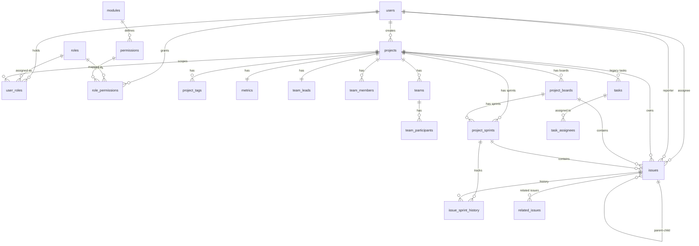
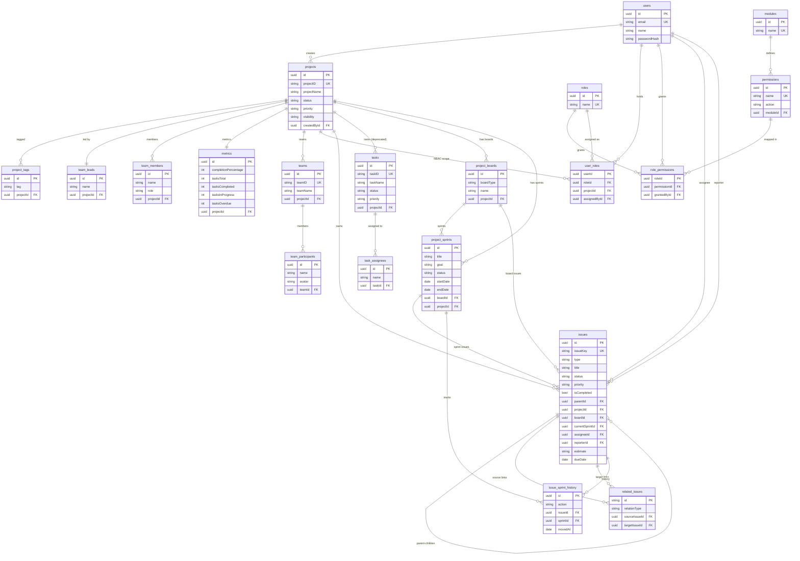

# FlowDesk — Complete Database Architecture (Scrum + Kanban)

> **Product:** FlowDesk — Jira-like Project Management System
> **Database:** PostgreSQL 15+
> **ORM:** Prisma 5.x
> **Designed:** April 7, 2026
> **Architect scope:** Full system — Auth, RBAC, Projects, Boards, Sprints, Issues, Teams
> **Total tables:** 20 (17 existing + 3 new) | **Enums:** 7 (5 existing + 2 new)

---

## Table of Contents

1. [Executive Summary](#1-executive-summary)
2. [Domain Groups](#2-domain-groups)
3. [Enums Reference](#3-enums-reference)
4. [Design Decisions](#4-design-decisions)
5. [New Tables — Scrum Layer](#5-new-tables--scrum-layer)
6. [Changes to Existing Tables](#6-changes-to-existing-tables)
7. [Full Prisma Schema (Copy-Paste Ready)](#7-full-prisma-schema-copy-paste-ready)
8. [Complete Table Definitions](#8-complete-table-definitions)
9. [Constraints & Business Rules](#9-constraints--business-rules)
10. [Relationships Summary](#10-relationships-summary)
11. [Migration Plan](#11-migration-plan)
12. [Full ER Diagram](#12-full-er-diagram)

---

## 1. Executive Summary

FlowDesk extends from a pure Kanban system to a **dual-methodology platform** (Kanban + Scrum) — matching Jira's internal architecture.

### What changes:

| Area | Change |
|------|--------|
| **3 new tables** | `project_boards`, `project_sprints`, `issue_sprint_history` |
| **2 new enums** | `BoardType`, `SprintStatus` |
| **2 new columns on `issues`** | `boardId`, `currentSprintId` |
| **0 tables removed** | `tasks` marked deprecated, not dropped |
| **0 breaking changes** | All existing Kanban behavior is preserved |

### Core architectural principle:

> **`issues` remains the single source of truth for all work items.**
> Backlog = `issues WHERE currentSprintId IS NULL AND boardId = <scrumBoardId>`.
> No separate backlog table. No duplication. Clean Jira-like model.

---

## 2. Domain Groups

| Domain | Tables | Status |
|--------|--------|--------|
| **Auth** | `users` | Existing |
| **Project Management** | `projects`, `project_tags`, `team_leads`, `team_members`, `metrics` | Existing |
| **Boards & Sprints** | `project_boards`, `project_sprints`, `issue_sprint_history` | **NEW** |
| **Issues** | `issues`, `related_issues` | Existing — **modified** |
| **Task Management** | `tasks`, `task_assignees` | Existing — **DEPRECATED** |
| **Teams** | `teams`, `team_participants` | Existing |
| **RBAC** | `roles`, `modules`, `permissions`, `role_permissions`, `user_roles` | Existing |

---

## 3. Enums Reference

### Existing Enums (unchanged)

| Enum | Values |
|------|--------|
| `IssueType` | `EPIC` · `STORY` · `TASK` · `BUG` |
| `RelationType` | `BLOCKS` · `DEPENDS_ON` · `RELATES_TO` · `DUPLICATES` |
| `IssueStatus` | `TODO` · `IN_PROGRESS` · `DONE` |
| `IssuePriority` | `LOW` · `MEDIUM` · `HIGH` |
| `Visibility` | `PRIVATE` · `PUBLIC` |

### New Enums

| Enum | Values | Purpose |
|------|--------|---------|
| `BoardType` | `KANBAN` · `SCRUM` | Defines methodology for a project board |
| `SprintStatus` | `PLANNED` · `ACTIVE` · `COMPLETED` | Sprint lifecycle state machine |

---

## 4. Design Decisions

### 4.1 Why Backlog is NOT a Table

In Jira, the backlog is not a database entity — it's a **query result**:

```sql
SELECT * FROM issues
WHERE board_id = <scrum_board_id>
  AND current_sprint_id IS NULL
  AND type != 'EPIC'
ORDER BY rank ASC;
```

**Rationale:**
- Creating a `backlog` table would duplicate issue references
- Moving issues to/from backlog would require syncing two tables
- Filtering is O(1) via index on `(boardId, currentSprintId)`
- Matches Jira's internal architecture exactly

### 4.2 Why `currentSprintId` on `issues`

Each issue belongs to **at most one sprint at a time**. This is a direct FK — not a junction table.

**Why not a junction table (issue_sprints)?**
- An issue is NEVER in two sprints simultaneously
- One-to-many is simpler, faster, and correct
- Sprint history is tracked separately in `issue_sprint_history`

**Lifecycle:**
```
Backlog (sprintId=NULL) → Sprint Planning (sprintId=sprint1)
                        → Sprint Active → Sprint Complete
                        → Incomplete items → Next Sprint or Backlog
```

### 4.3 Why the Board System is Introduced

Jira separates **project methodology** from **project data**:

- A project can have a **Kanban board** (continuous flow, no sprints)
- A project can have a **Scrum board** (sprint-based, backlog + active sprint)
- Some Jira projects have BOTH

**The `project_boards` table is the bridge between project and methodology.**

Without it, every sprint/backlog query would need to know "is this project Kanban or Scrum?" — coupling methodology logic into every query.

With it:
```
Project → Board(SCRUM) → Sprints → Issues
Project → Board(KANBAN) → Issues (no sprints, continuous flow)
```

### 4.4 How This Matches Jira Architecture

| Jira Concept | FlowDesk Implementation |
|-------------|------------------------|
| Project | `projects` table |
| Board | `project_boards` table — one per methodology |
| Sprint | `project_sprints` table — linked to board |
| Backlog | Query: `issues WHERE currentSprintId IS NULL` |
| Active Sprint Board | Query: `issues WHERE currentSprintId = <active_sprint>` grouped by `status` |
| Sprint Report | `issue_sprint_history` + sprint dates |
| Issue hierarchy | `issues.parentId` self-relation (EPIC→STORY→TASK/BUG) |
| Related Issues | `related_issues` table (BLOCKS, DEPENDS_ON, RELATES_TO, DUPLICATES) |
| Permissions | `user_roles` → `role_permissions` → `permissions` (project-scoped RBAC) |

### 4.5 Why `tasks` Table is Deprecated (Not Removed)

- The `tasks` table was the pre-Issue legacy workhorse
- All Kanban + Scrum logic now runs through `issues`
- Removing `tasks` would break existing API routes and data
- **Strategy:** Mark deprecated, stop all new writes, keep for historical reference
- **Future:** Drop `tasks` + `task_assignees` in a later cleanup migration

---

## 5. New Tables — Scrum Layer

### 5.1 `project_boards`

The methodology bridge. Each project gets boards on creation.

| Column | Type | Constraint | Notes |
|--------|------|-----------|-------|
| `id` | UUID | PK | Auto-generated |
| `boardType` | BoardType | NOT NULL | `KANBAN` or `SCRUM` |
| `name` | String | NOT NULL | Display name, e.g. "SCRUM Board" |
| `projectId` | UUID | FK → projects (CASCADE) | — |
| `createdAt` | DateTime | DEFAULT now() | — |
| `updatedAt` | DateTime | @updatedAt | — |

**Unique constraint:** `(projectId, boardType)` — max one board per type per project.

**Indexes:** `projectId`

---

### 5.2 `project_sprints`

Sprint lifecycle management. One ACTIVE sprint per board at any time.

| Column | Type | Constraint | Notes |
|--------|------|-----------|-------|
| `id` | UUID | PK | Auto-generated |
| `title` | String | NOT NULL | e.g. "Sprint 1", "Sprint 2" |
| `goal` | String? | nullable | Sprint goal — what the team commits to |
| `status` | SprintStatus | DEFAULT `PLANNED` | `PLANNED` → `ACTIVE` → `COMPLETED` |
| `startDate` | DateTime? | nullable | Set when sprint is started |
| `endDate` | DateTime? | nullable | Set when sprint is started (typically +2 weeks) |
| `completedAt` | DateTime? | nullable | Actual completion timestamp |
| `boardId` | UUID | FK → project_boards (CASCADE) | Links sprint to a Scrum board |
| `projectId` | UUID | FK → projects (CASCADE) | Denormalized for fast queries |
| `createdAt` | DateTime | DEFAULT now() | — |
| `updatedAt` | DateTime | @updatedAt | — |

**Indexes:** `boardId`, `projectId`, `status`, `(projectId, status)` composite

**Business rule:** Only ONE sprint with `status = ACTIVE` per `projectId` (enforced at application layer — PostgreSQL partial unique index in raw SQL migration).

---

### 5.3 `issue_sprint_history`

Audit trail for issue-to-sprint movement. Enables sprint velocity reports and burndown charts.

| Column | Type | Constraint | Notes |
|--------|------|-----------|-------|
| `id` | UUID | PK | Auto-generated |
| `issueId` | UUID | FK → issues (CASCADE) | — |
| `sprintId` | UUID | FK → project_sprints (CASCADE) | — |
| `action` | String | NOT NULL | `ADDED` · `REMOVED` · `COMPLETED` · `CARRIED_OVER` |
| `movedAt` | DateTime | DEFAULT now() | When the movement happened |

**Indexes:** `issueId`, `sprintId`, `(issueId, sprintId)` composite

---

## 6. Changes to Existing Tables

### 6.1 `issues` — Two New Columns

| New Column | Type | Constraint | Why |
|-----------|------|-----------|-----|
| `boardId` | UUID? | FK → project_boards, nullable | Links issue to a board. NULL = legacy issue pre-boards |
| `currentSprintId` | UUID? | FK → project_sprints, nullable | Which sprint this issue is in. NULL = Backlog or Kanban |

**Indexes added:**
- `(boardId)` — filter issues by board
- `(currentSprintId)` — filter issues by sprint
- `(projectId, currentSprintId)` — composite: backlog query (sprint=NULL + projectId)
- `(boardId, currentSprintId, status)` — composite: sprint board columns

**No existing columns removed. No existing behavior changed.**

Kanban flow (`issues.status` only) continues to work exactly as before — `boardId` and `currentSprintId` are nullable and ignored by Kanban views.

### 6.2 `projects` — New Relation Only

No column changes. Only a new Prisma relation added:

```
boards  ProjectBoard[]
sprints ProjectSprint[]
```

These are relation-only fields — no column is added to the `projects` table.

### 6.3 `related_issues` — Conceptual Rename Only

The table stays as `related_issues` in the database (no migration needed). The conceptual name "Related Issues" is used in the API layer and UI. The `relationType` enum already covers: `BLOCKS`, `DEPENDS_ON`, `RELATES_TO`, `DUPLICATES`.

**No schema change required.**

### 6.4 `tasks` — Deprecated

```prisma
/// @deprecated — Legacy table. All new work items use `issues`. 
/// Retained for backward compatibility. Will be dropped in future cleanup.
model Task { ... }
```

No columns added or removed. Just marked deprecated.

---

## 7. Full Prisma Schema (Copy-Paste Ready)

> This is the **complete** schema including all existing tables + all Scrum additions.
> Replace `backend/prisma/schema.prisma` with this file.

```prisma
// ╔══════════════════════════════════════════════════════════════════════╗
// ║  FlowDesk — Complete Database Schema                                ║
// ║  PostgreSQL · Prisma ORM                                            ║
// ║  Created: March 17, 2026                                            ║
// ║  Updated: April 7, 2026 — Phase 3: Scrum (Boards, Sprints)         ║
// ║                                                                      ║
// ║  Domains: Auth, RBAC, Projects, Boards, Sprints, Issues, Teams      ║
// ║  Tables: 20  |  Enums: 7                                            ║
// ╚══════════════════════════════════════════════════════════════════════╝

generator client {
  provider = "prisma-client-js"
}

datasource db {
  provider = "postgresql"
}

// ════════════════════════════════════════════════════════════════════════
// ENUMS
// ════════════════════════════════════════════════════════════════════════

enum IssueType {
  EPIC
  STORY
  TASK
  BUG
}

enum RelationType {
  BLOCKS
  DEPENDS_ON
  RELATES_TO
  DUPLICATES
}

enum IssueStatus {
  TODO
  IN_PROGRESS
  DONE
}

enum IssuePriority {
  LOW
  MEDIUM
  HIGH
}

enum Visibility {
  PRIVATE
  PUBLIC
}

// ── NEW: Phase 3 Scrum enums ────────────────────────────────────────────

enum BoardType {
  KANBAN
  SCRUM
}

enum SprintStatus {
  PLANNED
  ACTIVE
  COMPLETED
}

// ════════════════════════════════════════════════════════════════════════
// USERS — Authentication
// ════════════════════════════════════════════════════════════════════════

model User {
  id           String   @id @default(uuid())
  email        String   @unique
  name         String
  passwordHash String
  createdAt    DateTime @default(now())
  updatedAt    DateTime @updatedAt

  // RBAC
  userRoles         UserRole[]
  assignedRoles     UserRole[]         @relation("AssignedByUser")
  grantedPerms      RolePermission[]
  createdProjects   Project[]          @relation("ProjectCreator")

  // Issues
  assignedIssues    Issue[]            @relation("IssueAssignee")
  reportedIssues    Issue[]            @relation("IssueReporter")

  @@index([email])
  @@map("users")
}

// ════════════════════════════════════════════════════════════════════════
// PROJECTS — Global View
// ════════════════════════════════════════════════════════════════════════

model Project {
  id                  String     @id @default(uuid())
  projectID           String     @unique
  projectName         String
  projectDescription  String?
  status              String
  statusLabel         String
  priority            String
  category            String

  createdDate         DateTime   @default(now())
  assignedDate        DateTime
  dueDate             DateTime?
  completedDate       DateTime?

  teamID              String
  teamName            String
  assigneeID          String
  assigneeName        String
  assigneeAvatar      String
  assigneeAvatarColor String

  isRecurring         Boolean    @default(false)
  recurringFrequency  String?

  projectKey          String?    @unique
  visibility          Visibility @default(PRIVATE)

  createdById         String?
  createdBy           User?      @relation("ProjectCreator", fields: [createdById], references: [id], onDelete: SetNull)

  // ── Relations ──────────────────────────────────────────────────────
  teamLead            TeamLead?
  teamMembers         TeamMember[]
  metrics             Metrics?
  tags                ProjectTag[]
  teams               Team[]
  tasks               Task[]              // @deprecated — legacy relation
  issues              Issue[]
  userRoles           UserRole[]
  boards              ProjectBoard[]      // NEW: Phase 3
  sprints             ProjectSprint[]     // NEW: Phase 3

  createdAt           DateTime   @default(now())
  updatedAt           DateTime   @updatedAt

  @@index([status])
  @@index([priority])
  @@index([teamID])
  @@map("projects")
}

model ProjectTag {
  id        String  @id @default(uuid())
  tag       String
  projectId String
  project   Project @relation(fields: [projectId], references: [id], onDelete: Cascade)

  @@map("project_tags")
}

model TeamLead {
  id          String  @id @default(uuid())
  leadId      String
  name        String
  avatar      String
  avatarColor String
  projectId   String  @unique
  project     Project @relation(fields: [projectId], references: [id], onDelete: Cascade)

  @@map("team_leads")
}

model TeamMember {
  id          String  @id @default(uuid())
  memberId    String
  name        String
  avatar      String
  avatarColor String
  role        String
  status      String  @default("online")
  projectId   String
  project     Project @relation(fields: [projectId], references: [id], onDelete: Cascade)

  @@map("team_members")
}

model Metrics {
  id                    String  @id @default(uuid())
  completionPercentage  Int     @default(0)
  tasksTotal            Int     @default(0)
  tasksCompleted        Int     @default(0)
  tasksInProgress       Int     @default(0)
  tasksOverdue          Int     @default(0)
  projectId             String  @unique
  project               Project @relation(fields: [projectId], references: [id], onDelete: Cascade)

  @@map("metrics")
}

// ════════════════════════════════════════════════════════════════════════
// BOARDS — Phase 3: Methodology layer
// ════════════════════════════════════════════════════════════════════════
// Each project can have at most ONE Kanban board and ONE Scrum board.
// The board is the bridge between project methodology and work items.

model ProjectBoard {
  id         String    @id @default(uuid())
  boardType  BoardType
  name       String                         // Display name, e.g. "SCRUM Board"

  projectId  String
  project    Project   @relation(fields: [projectId], references: [id], onDelete: Cascade)

  // Relations
  sprints    ProjectSprint[]
  issues     Issue[]

  createdAt  DateTime  @default(now())
  updatedAt  DateTime  @updatedAt

  // One board per type per project
  @@unique([projectId, boardType])
  @@index([projectId])
  @@map("project_boards")
}

// ════════════════════════════════════════════════════════════════════════
// SPRINTS — Phase 3: Sprint lifecycle management
// ════════════════════════════════════════════════════════════════════════
// State machine: PLANNED → ACTIVE → COMPLETED
// Only ONE sprint can be ACTIVE per project at any time.
// Sprints are always linked to a Scrum board.

model ProjectSprint {
  id          String       @id @default(uuid())
  title       String                                // "Sprint 1", "Sprint 2"
  goal        String?                               // Sprint goal (commitment statement)
  status      SprintStatus @default(PLANNED)        // PLANNED → ACTIVE → COMPLETED
  startDate   DateTime?                             // Set when sprint is activated
  endDate     DateTime?                             // Planned end date (start + duration)
  completedAt DateTime?                             // Actual completion timestamp

  boardId     String
  board       ProjectBoard @relation(fields: [boardId], references: [id], onDelete: Cascade)

  // Denormalized for fast queries — avoids join through boards
  projectId   String
  project     Project      @relation(fields: [projectId], references: [id], onDelete: Cascade)

  // Relations
  issues      Issue[]                               // Issues currently in this sprint
  history     IssueSprintHistory[]                  // Audit trail of issue movements

  createdAt   DateTime     @default(now())
  updatedAt   DateTime     @updatedAt

  @@index([boardId])
  @@index([projectId])
  @@index([status])
  @@index([projectId, status])                      // Fast: "find active sprint for project"
  @@map("project_sprints")
}

// ════════════════════════════════════════════════════════════════════════
// ISSUE SPRINT HISTORY — Phase 3: Audit trail
// ════════════════════════════════════════════════════════════════════════
// Tracks every movement of an issue to/from sprints.
// Enables: sprint velocity, burndown charts, carry-over reports.
//
// Actions:
//   ADDED        — issue was added to sprint during planning or mid-sprint
//   REMOVED      — issue was removed from sprint back to backlog
//   COMPLETED    — issue was DONE when sprint completed
//   CARRIED_OVER — issue was incomplete at sprint end, moved to next sprint

model IssueSprintHistory {
  id        String        @id @default(uuid())
  action    String                                  // ADDED | REMOVED | COMPLETED | CARRIED_OVER

  issueId   String
  issue     Issue         @relation(fields: [issueId], references: [id], onDelete: Cascade)

  sprintId  String
  sprint    ProjectSprint @relation(fields: [sprintId], references: [id], onDelete: Cascade)

  movedAt   DateTime      @default(now())

  @@index([issueId])
  @@index([sprintId])
  @@index([issueId, sprintId])                      // Fast: "all movements of issue X in sprint Y"
  @@map("issue_sprint_history")
}

// ════════════════════════════════════════════════════════════════════════
// TASK MANAGEMENT — @deprecated (Legacy)
// ════════════════════════════════════════════════════════════════════════
// These tables are retained for backward compatibility only.
// All new work items use the `issues` table.
// DO NOT add new features to tasks. Will be dropped in future cleanup.

/// @deprecated — Use `issues` table instead. Retained for backward compatibility.
model Task {
  id                   String         @id @default(uuid())
  taskID               String         @unique
  taskName             String
  taskDescription      String?
  status               String         @default("todo")
  priority             String
  isRecurring          Boolean        @default(false)
  recurringFrequency   String?
  createdAt            DateTime       @default(now())
  dueDate              DateTime
  completedDate        DateTime?
  projectId            String
  project              Project        @relation(fields: [projectId], references: [id], onDelete: Cascade)
  assignees            TaskAssignee[]

  @@index([projectId])
  @@index([status])
  @@index([dueDate])
  @@map("tasks")
}

/// @deprecated — Use issue assignee relation instead.
model TaskAssignee {
  id          String @id @default(uuid())
  name        String
  avatar      String @default("")
  avatarColor String @default("#4361ee")
  taskId      String
  task        Task   @relation(fields: [taskId], references: [id], onDelete: Cascade)

  @@map("task_assignees")
}

// ════════════════════════════════════════════════════════════════════════
// TEAMS — First-class entities per project
// ════════════════════════════════════════════════════════════════════════

model Team {
  id        String           @id @default(uuid())
  teamID    String           @unique
  teamName  String
  createdAt DateTime         @default(now())
  projectId String
  project   Project          @relation(fields: [projectId], references: [id], onDelete: Cascade)
  members   TeamParticipant[]

  @@map("teams")
}

model TeamParticipant {
  id     String @id @default(uuid())
  name   String
  avatar String
  color  String @default("#4361ee")
  teamId String
  team   Team   @relation(fields: [teamId], references: [id], onDelete: Cascade)

  @@map("team_participants")
}

// ════════════════════════════════════════════════════════════════════════
// RBAC — Role-Based Access Control (Phase 1)
// Architecture: User → Role (per Project) → Permission → Module
// ════════════════════════════════════════════════════════════════════════

model Role {
  id          String   @id @default(uuid())
  name        String   @unique
  description String?
  createdAt   DateTime @default(now())
  updatedAt   DateTime @updatedAt
  rolePermissions RolePermission[]
  userRoles       UserRole[]

  @@map("roles")
}

model Module {
  id          String       @id @default(uuid())
  name        String       @unique
  description String?
  createdAt   DateTime     @default(now())
  permissions Permission[]

  @@map("modules")
}

model Permission {
  id          String   @id @default(uuid())
  name        String   @unique
  action      String
  description String?
  createdAt   DateTime @default(now())
  moduleId    String
  module      Module   @relation(fields: [moduleId], references: [id], onDelete: Cascade)
  rolePermissions RolePermission[]

  @@index([moduleId])
  @@map("permissions")
}

model RolePermission {
  roleId       String
  permissionId String
  grantedAt    DateTime   @default(now())
  grantedById  String?
  grantedBy    User?      @relation(fields: [grantedById], references: [id], onDelete: SetNull)
  role         Role       @relation(fields: [roleId], references: [id], onDelete: Cascade)
  permission   Permission @relation(fields: [permissionId], references: [id], onDelete: Cascade)

  @@id([roleId, permissionId])
  @@map("role_permissions")
}

model UserRole {
  userId       String
  roleId       String
  projectId    String
  assignedAt   DateTime @default(now())
  assignedById String?
  assignedBy   User?    @relation("AssignedByUser", fields: [assignedById], references: [id], onDelete: SetNull)
  user         User     @relation(fields: [userId], references: [id], onDelete: Cascade)
  role         Role     @relation(fields: [roleId], references: [id], onDelete: Cascade)
  project      Project  @relation(fields: [projectId], references: [id], onDelete: Cascade)

  @@id([userId, roleId, projectId])
  @@unique([userId, projectId])
  @@index([userId, projectId])
  @@map("user_roles")
}

// ════════════════════════════════════════════════════════════════════════
// ISSUES — Jira-style hierarchical issue tracking (Phase 2 + Phase 3)
// Hierarchy: EPIC → STORY → TASK → BUG (via self-relation parentId)
// Phase 3 additions: boardId, currentSprintId
// ════════════════════════════════════════════════════════════════════════

model Issue {
  id          String        @id @default(uuid())
  issueKey    String        @unique           // "PRJ-001-1", scoped per project
  type        IssueType
  title       String
  description String?
  status      IssueStatus   @default(TODO)
  priority    IssuePriority @default(MEDIUM)

  // EPIC container flag
  isCompleted Boolean       @default(false)

  // Hierarchy (self-relation)
  parentId    String?
  parent      Issue?        @relation("IssueChildren", fields: [parentId], references: [id], onDelete: SetNull)
  children    Issue[]       @relation("IssueChildren")

  // related issues
  sourceLinks RelatedIssue[]   @relation("SourceIssue")
  targetLinks RelatedIssue[]   @relation("TargetIssue")

  // Project ownership
  projectId   String
  project     Project       @relation(fields: [projectId], references: [id], onDelete: Cascade)

  // ── Phase 3: Board & Sprint assignment ──────────────────────────────
  // boardId: which board this issue belongs to (NULL = legacy pre-board issues)
  // currentSprintId: which sprint (NULL = Backlog for Scrum, or normal Kanban)
  boardId          String?
  board            ProjectBoard?   @relation(fields: [boardId], references: [id], onDelete: SetNull)
  currentSprintId  String?
  currentSprint    ProjectSprint?  @relation(fields: [currentSprintId], references: [id], onDelete: SetNull)
  sprintHistory    IssueSprintHistory[]

  // User relations
  assigneeId  String?
  assignee    User?         @relation("IssueAssignee", fields: [assigneeId], references: [id], onDelete: SetNull)
  reporterId  String?
  reporter    User?         @relation("IssueReporter", fields: [reporterId], references: [id], onDelete: SetNull)

  createdAt   DateTime      @default(now())
  updatedAt   DateTime      @updatedAt

  // Time tracking
  estimate    String?
  dueDate     DateTime?

  // ── Indexes ─────────────────────────────────────────────────────────
  @@index([projectId])
  @@index([parentId])
  @@index([assigneeId])
  @@index([status])
  @@index([type])
  @@index([boardId])                                  // NEW: filter by board
  @@index([currentSprintId])                          // NEW: filter by sprint
  @@index([projectId, currentSprintId])               // NEW: backlog query
  @@index([boardId, currentSprintId, status])          // NEW: sprint board columns
  @@map("issues")
}

// ════════════════════════════════════════════════════════════════════════
// related issues — Jira-style relationships between issues
// Conceptually: "Related Issues"
// ════════════════════════════════════════════════════════════════════════

model RelatedIssue {
  id            String        @id @default(cuid())
  relationType  RelationType
  sourceIssueId String
  targetIssueId String
  source        Issue         @relation("SourceIssue", fields: [sourceIssueId], references: [id], onDelete: Cascade)
  target        Issue         @relation("TargetIssue", fields: [targetIssueId], references: [id], onDelete: Cascade)
  createdAt     DateTime      @default(now())

  @@unique([sourceIssueId, targetIssueId, relationType])
  @@index([sourceIssueId])
  @@index([targetIssueId])
  @@map("related_issues")
}
```

---

## 8. Complete Table Definitions

### 8.1 `users`

| Column | Type | Constraint | Notes |
|--------|------|-----------|-------|
| `id` | UUID | PK | |
| `email` | String | UNIQUE | Login identifier |
| `name` | String | | Display name |
| `passwordHash` | String | | Bcrypt hash |
| `createdAt` | DateTime | DEFAULT now() | |
| `updatedAt` | DateTime | @updatedAt | |

---

### 8.2 `projects`

| Column | Type | Constraint | Notes |
|--------|------|-----------|-------|
| `id` | UUID | PK | |
| `projectID` | String | UNIQUE | E.g. `PRJ-001` |
| `projectName` | String | | |
| `projectDescription` | String? | nullable | |
| `status` | String | | `todo` / `in-progress` / `completed` / `overdue` |
| `statusLabel` | String | | Human-readable |
| `priority` | String | | `critical` / `medium` / `low` |
| `category` | String | | |
| `createdDate` | DateTime | DEFAULT now() | |
| `assignedDate` | DateTime | | |
| `dueDate` | DateTime? | nullable | |
| `completedDate` | DateTime? | nullable | |
| `teamID` | String | | Legacy team ref |
| `teamName` | String | | |
| `assigneeID` | String | | |
| `assigneeName` | String | | |
| `assigneeAvatar` | String | | |
| `assigneeAvatarColor` | String | | |
| `isRecurring` | Boolean | DEFAULT false | |
| `recurringFrequency` | String? | nullable | |
| `projectKey` | String? | UNIQUE, nullable | E.g. `SCRUM` |
| `visibility` | Visibility | DEFAULT PRIVATE | |
| `createdById` | UUID? | FK → users, nullable | RBAC ownership |
| `createdAt` | DateTime | DEFAULT now() | |
| `updatedAt` | DateTime | @updatedAt | |

**Indexes:** `status`, `priority`, `teamID`

---

### 8.3 `project_boards` — NEW

| Column | Type | Constraint | Notes |
|--------|------|-----------|-------|
| `id` | UUID | PK | |
| `boardType` | BoardType | NOT NULL | `KANBAN` or `SCRUM` |
| `name` | String | NOT NULL | Display name |
| `projectId` | UUID | FK → projects (CASCADE) | |
| `createdAt` | DateTime | DEFAULT now() | |
| `updatedAt` | DateTime | @updatedAt | |

**Unique:** `(projectId, boardType)` — one board per type per project
**Index:** `projectId`

---

### 8.4 `project_sprints` — NEW

| Column | Type | Constraint | Notes |
|--------|------|-----------|-------|
| `id` | UUID | PK | |
| `title` | String | NOT NULL | "Sprint 1", "Sprint 2" |
| `goal` | String? | nullable | Sprint goal statement |
| `status` | SprintStatus | DEFAULT `PLANNED` | Lifecycle state |
| `startDate` | DateTime? | nullable | Set when activated |
| `endDate` | DateTime? | nullable | Planned end |
| `completedAt` | DateTime? | nullable | Actual completion |
| `boardId` | UUID | FK → project_boards (CASCADE) | |
| `projectId` | UUID | FK → projects (CASCADE) | Denormalized |
| `createdAt` | DateTime | DEFAULT now() | |
| `updatedAt` | DateTime | @updatedAt | |

**Indexes:** `boardId`, `projectId`, `status`, `(projectId, status)`

---

### 8.5 `issue_sprint_history` — NEW

| Column | Type | Constraint | Notes |
|--------|------|-----------|-------|
| `id` | UUID | PK | |
| `action` | String | NOT NULL | `ADDED` / `REMOVED` / `COMPLETED` / `CARRIED_OVER` |
| `issueId` | UUID | FK → issues (CASCADE) | |
| `sprintId` | UUID | FK → project_sprints (CASCADE) | |
| `movedAt` | DateTime | DEFAULT now() | |

**Indexes:** `issueId`, `sprintId`, `(issueId, sprintId)`

---

### 8.6 `issues` — MODIFIED

All existing columns retained. Two new columns added:

| New Column | Type | Constraint | Notes |
|-----------|------|-----------|-------|
| `boardId` | UUID? | FK → project_boards (SetNull), nullable | Board assignment |
| `currentSprintId` | UUID? | FK → project_sprints (SetNull), nullable | Sprint assignment (NULL = Backlog) |

**New Indexes:** `boardId`, `currentSprintId`, `(projectId, currentSprintId)`, `(boardId, currentSprintId, status)`

---

### 8.7 `project_tags`

| Column | Type | Constraint |
|--------|------|-----------|
| `id` | UUID | PK |
| `tag` | String | |
| `projectId` | UUID | FK → projects (CASCADE) |

---

### 8.8 `team_leads`

| Column | Type | Constraint |
|--------|------|-----------|
| `id` | UUID | PK |
| `leadId` | String | |
| `name` | String | |
| `avatar` | String | |
| `avatarColor` | String | |
| `projectId` | UUID | FK → projects (UNIQUE, CASCADE) |

---

### 8.9 `team_members`

| Column | Type | Constraint |
|--------|------|-----------|
| `id` | UUID | PK |
| `memberId` | String | |
| `name` | String | |
| `avatar` | String | |
| `avatarColor` | String | |
| `role` | String | |
| `status` | String | DEFAULT `online` |
| `projectId` | UUID | FK → projects (CASCADE) |

---

### 8.10 `metrics`

| Column | Type | Constraint |
|--------|------|-----------|
| `id` | UUID | PK |
| `completionPercentage` | Int | DEFAULT 0 |
| `tasksTotal` | Int | DEFAULT 0 |
| `tasksCompleted` | Int | DEFAULT 0 |
| `tasksInProgress` | Int | DEFAULT 0 |
| `tasksOverdue` | Int | DEFAULT 0 |
| `projectId` | UUID | FK → projects (UNIQUE, CASCADE) |

---

### 8.11 `tasks` — DEPRECATED

| Column | Type | Constraint |
|--------|------|-----------|
| `id` | UUID | PK |
| `taskID` | String | UNIQUE |
| `taskName` | String | |
| `taskDescription` | String? | nullable |
| `status` | String | DEFAULT `todo` |
| `priority` | String | |
| `isRecurring` | Boolean | DEFAULT false |
| `recurringFrequency` | String? | nullable |
| `createdAt` | DateTime | DEFAULT now() |
| `dueDate` | DateTime | |
| `completedDate` | DateTime? | nullable |
| `projectId` | UUID | FK → projects (CASCADE) |

**Status:** ⚠️ DEPRECATED — do not use for new features

---

### 8.12 `task_assignees` — DEPRECATED

| Column | Type | Constraint |
|--------|------|-----------|
| `id` | UUID | PK |
| `name` | String | |
| `avatar` | String | DEFAULT `""` |
| `avatarColor` | String | DEFAULT `#4361ee` |
| `taskId` | UUID | FK → tasks (CASCADE) |

**Status:** ⚠️ DEPRECATED

---

### 8.13 `teams`

| Column | Type | Constraint |
|--------|------|-----------|
| `id` | UUID | PK |
| `teamID` | String | UNIQUE |
| `teamName` | String | |
| `createdAt` | DateTime | DEFAULT now() |
| `projectId` | UUID | FK → projects (CASCADE) |

---

### 8.14 `team_participants`

| Column | Type | Constraint |
|--------|------|-----------|
| `id` | UUID | PK |
| `name` | String | |
| `avatar` | String | |
| `color` | String | DEFAULT `#4361ee` |
| `teamId` | UUID | FK → teams (CASCADE) |

---

### 8.15 `roles`

| Column | Type | Constraint |
|--------|------|-----------|
| `id` | UUID | PK |
| `name` | String | UNIQUE |
| `description` | String? | nullable |
| `createdAt` | DateTime | DEFAULT now() |
| `updatedAt` | DateTime | @updatedAt |

---

### 8.16 `modules`

| Column | Type | Constraint |
|--------|------|-----------|
| `id` | UUID | PK |
| `name` | String | UNIQUE |
| `description` | String? | nullable |
| `createdAt` | DateTime | DEFAULT now() |

---

### 8.17 `permissions`

| Column | Type | Constraint |
|--------|------|-----------|
| `id` | UUID | PK |
| `name` | String | UNIQUE |
| `action` | String | |
| `description` | String? | nullable |
| `createdAt` | DateTime | DEFAULT now() |
| `moduleId` | UUID | FK → modules (CASCADE) |

**Index:** `moduleId`

---

### 8.18 `role_permissions`

| Column | Type | Constraint |
|--------|------|-----------|
| `roleId` | UUID | CPK + FK → roles (CASCADE) |
| `permissionId` | UUID | CPK + FK → permissions (CASCADE) |
| `grantedAt` | DateTime | DEFAULT now() |
| `grantedById` | UUID? | FK → users (SetNull) |

**Composite PK:** `(roleId, permissionId)`

---

### 8.19 `user_roles`

| Column | Type | Constraint |
|--------|------|-----------|
| `userId` | UUID | CPK + FK → users (CASCADE) |
| `roleId` | UUID | CPK + FK → roles (CASCADE) |
| `projectId` | UUID | CPK + FK → projects (CASCADE) |
| `assignedAt` | DateTime | DEFAULT now() |
| `assignedById` | UUID? | FK → users (SetNull) |

**Composite PK:** `(userId, roleId, projectId)`
**Unique:** `(userId, projectId)` — one role per user per project

---

### 8.20 `related_issues`

| Column | Type | Constraint |
|--------|------|-----------|
| `id` | CUID | PK |
| `relationType` | RelationType | Enum |
| `sourceIssueId` | UUID | FK → issues (CASCADE) |
| `targetIssueId` | UUID | FK → issues (CASCADE) |
| `createdAt` | DateTime | DEFAULT now() |

**Unique:** `(sourceIssueId, targetIssueId, relationType)`

---

## 9. Constraints & Business Rules

### 9.1 Database-Level Constraints

| Constraint | Table | Rule |
|-----------|-------|------|
| `@@unique([projectId, boardType])` | `project_boards` | Max one board per type per project |
| `@@unique([userId, projectId])` | `user_roles` | One role per user per project |
| `@@unique([sourceIssueId, targetIssueId, relationType])` | `related_issues` | No duplicate links |
| FK `onDelete: Cascade` | Boards, Sprints, History | Delete project → all cascade |
| FK `onDelete: SetNull` | `issues.boardId`, `issues.currentSprintId` | Delete board/sprint → issues go to unassigned, not deleted |

### 9.2 Application-Level Business Rules

| Rule | Enforcement | SQL/Logic |
|------|-------------|-----------|
| **One ACTIVE sprint per project** | App layer + partial unique index | `CREATE UNIQUE INDEX idx_one_active_sprint ON project_sprints (project_id) WHERE status = 'ACTIVE'` |
| **Issue-Sprint project match** | Service layer validation | Before setting `currentSprintId`, verify `issue.projectId === sprint.projectId` |
| **Sprint state machine** | Service layer | `PLANNED → ACTIVE → COMPLETED` (no backwards transitions) |
| **EPIC cannot be in sprint** | Service layer | EPICs are containers — only STORY/TASK/BUG can be assigned to sprints |
| **Sprint must belong to SCRUM board** | Service layer | Sprints can only be created on boards with `boardType = SCRUM` |
| **Backlog = sprintId IS NULL** | Query convention | No separate table, just a filtered query |
| **Carry-over on sprint complete** | Service layer | Incomplete issues → next PLANNED sprint or backlog (currentSprintId = NULL) |

### 9.3 Raw SQL Constraint (Partial Unique Index)

This must be added as a raw SQL migration after the Prisma migration:

```sql
-- Enforce only ONE active sprint per project at database level
CREATE UNIQUE INDEX IF NOT EXISTS idx_one_active_sprint
ON project_sprints (project_id)
WHERE status = 'ACTIVE';
```

Prisma doesn't support partial unique indexes natively, so this is applied via `prisma migrate` with a custom SQL step.

---

## 10. Relationships Summary

### 10.1 Full Relationships Table

| From | To | Type | Via / Notes |
|------|----|------|-------------|
| `users` | `projects` | 1 → N | `projects.createdById` |
| `users` | `user_roles` | 1 → N | as member |
| `users` | `user_roles` | 1 → N | as assigner (`assignedById`) |
| `users` | `role_permissions` | 1 → N | as granter (`grantedById`) |
| `users` | `issues` | 1 → N | as assignee |
| `users` | `issues` | 1 → N | as reporter |
| `projects` | `project_tags` | 1 → N | CASCADE |
| `projects` | `team_leads` | 1 → 1 | CASCADE |
| `projects` | `team_members` | 1 → N | CASCADE |
| `projects` | `metrics` | 1 → 1 | CASCADE |
| `projects` | `tasks` | 1 → N | CASCADE (deprecated) |
| `projects` | `teams` | 1 → N | CASCADE |
| `projects` | `user_roles` | 1 → N | CASCADE |
| `projects` | `issues` | 1 → N | CASCADE |
| `projects` | **`project_boards`** | 1 → N | CASCADE — **NEW** |
| `projects` | **`project_sprints`** | 1 → N | CASCADE — **NEW** (denormalized) |
| **`project_boards`** | **`project_sprints`** | 1 → N | CASCADE — **NEW** |
| **`project_boards`** | `issues` | 1 → N | SetNull — **NEW** |
| **`project_sprints`** | `issues` | 1 → N | SetNull — **NEW** |
| **`project_sprints`** | **`issue_sprint_history`** | 1 → N | CASCADE — **NEW** |
| `issues` | `issues` | 1 → N | self: parent → children (SetNull) |
| `issues` | `related_issues` | 1 → N | as source (CASCADE) |
| `issues` | `related_issues` | 1 → N | as target (CASCADE) |
| `issues` | **`issue_sprint_history`** | 1 → N | CASCADE — **NEW** |
| `tasks` | `task_assignees` | 1 → N | CASCADE (deprecated) |
| `teams` | `team_participants` | 1 → N | CASCADE |
| `roles` | `role_permissions` | 1 → N | CASCADE |
| `roles` | `user_roles` | 1 → N | CASCADE |
| `modules` | `permissions` | 1 → N | CASCADE |
| `permissions` | `role_permissions` | 1 → N | CASCADE |

### 10.2 Textual Relationship Diagram

```
┌─────────────────────────────────────────────────────────────────────┐
│                         SCRUM DATA FLOW                             │
│                                                                     │
│  Project                                                            │
│    ├── ProjectBoard (KANBAN)                                        │
│    │     └── Issues (boardId=kanbanBoard, sprintId=NULL)            │
│    │           ├── status: TODO | IN_PROGRESS | DONE                │
│    │           └── (continuous flow, no sprints)                    │
│    │                                                                │
│    ├── ProjectBoard (SCRUM)                                         │
│    │     ├── BACKLOG: Issues (boardId=scrumBoard, sprintId=NULL)   │
│    │     │                                                          │
│    │     ├── Sprint 1 (COMPLETED)                                   │
│    │     │     └── IssueSprintHistory entries                       │
│    │     │                                                          │
│    │     ├── Sprint 2 (ACTIVE)  ← only ONE active                  │
│    │     │     └── Issues (sprintId=sprint2)                        │
│    │     │           ├── TODO column                                │
│    │     │           ├── IN_PROGRESS column                         │
│    │     │           └── DONE column                                │
│    │     │                                                          │
│    │     └── Sprint 3 (PLANNED)                                     │
│    │                                                                │
│    └── UserRoles (RBAC scoped to this project)                     │
│          └── Role → Permissions → Modules                           │
│                                                                     │
│  Issue Hierarchy (independent of boards/sprints):                   │
│    EPIC → STORY → TASK / BUG                                       │
│                                                                     │
│  Related IssuRelated Issues (independent of boards/sprints):es                       │
│    BLOCKS | DEPENDS_ON | RELATES_TO | DUPLICATES                   │
└─────────────────────────────────────────────────────────────────────┘
```

---

## 11. Migration Plan

### Phase 3 Migration — Step-by-Step

#### Step 1: Create Enums (non-breaking)

```sql
CREATE TYPE "BoardType" AS ENUM ('KANBAN', 'SCRUM');
CREATE TYPE "SprintStatus" AS ENUM ('PLANNED', 'ACTIVE', 'COMPLETED');
```

#### Step 2: Create `project_boards` table

```sql
CREATE TABLE project_boards (
  id UUID PRIMARY KEY DEFAULT gen_random_uuid(),
  board_type "BoardType" NOT NULL,
  name TEXT NOT NULL,
  project_id UUID NOT NULL REFERENCES projects(id) ON DELETE CASCADE,
  created_at TIMESTAMPTZ DEFAULT now(),
  updated_at TIMESTAMPTZ DEFAULT now(),
  UNIQUE (project_id, board_type)
);
CREATE INDEX idx_project_boards_project ON project_boards(project_id);
```

#### Step 3: Create `project_sprints` table

```sql
CREATE TABLE project_sprints (
  id UUID PRIMARY KEY DEFAULT gen_random_uuid(),
  title TEXT NOT NULL,
  goal TEXT,
  status "SprintStatus" NOT NULL DEFAULT 'PLANNED',
  start_date TIMESTAMPTZ,
  end_date TIMESTAMPTZ,
  completed_at TIMESTAMPTZ,
  board_id UUID NOT NULL REFERENCES project_boards(id) ON DELETE CASCADE,
  project_id UUID NOT NULL REFERENCES projects(id) ON DELETE CASCADE,
  created_at TIMESTAMPTZ DEFAULT now(),
  updated_at TIMESTAMPTZ DEFAULT now()
);
CREATE INDEX idx_sprints_board ON project_sprints(board_id);
CREATE INDEX idx_sprints_project ON project_sprints(project_id);
CREATE INDEX idx_sprints_status ON project_sprints(status);
CREATE INDEX idx_sprints_project_status ON project_sprints(project_id, status);

-- Partial unique: only one ACTIVE sprint per project
CREATE UNIQUE INDEX idx_one_active_sprint
ON project_sprints (project_id) WHERE status = 'ACTIVE';
```

#### Step 4: Create `issue_sprint_history` table

```sql
CREATE TABLE issue_sprint_history (
  id UUID PRIMARY KEY DEFAULT gen_random_uuid(),
  action TEXT NOT NULL,
  issue_id UUID NOT NULL REFERENCES issues(id) ON DELETE CASCADE,
  sprint_id UUID NOT NULL REFERENCES project_sprints(id) ON DELETE CASCADE,
  moved_at TIMESTAMPTZ DEFAULT now()
);
CREATE INDEX idx_history_issue ON issue_sprint_history(issue_id);
CREATE INDEX idx_history_sprint ON issue_sprint_history(sprint_id);
CREATE INDEX idx_history_issue_sprint ON issue_sprint_history(issue_id, sprint_id);
```

#### Step 5: Add columns to `issues` (nullable — no existing data breaks)

```sql
ALTER TABLE issues ADD COLUMN board_id UUID REFERENCES project_boards(id) ON DELETE SET NULL;
ALTER TABLE issues ADD COLUMN current_sprint_id UUID REFERENCES project_sprints(id) ON DELETE SET NULL;

CREATE INDEX idx_issues_board ON issues(board_id);
CREATE INDEX idx_issues_sprint ON issues(current_sprint_id);
CREATE INDEX idx_issues_project_sprint ON issues(project_id, current_sprint_id);
CREATE INDEX idx_issues_board_sprint_status ON issues(board_id, current_sprint_id, status);
```

#### Step 6: Backfill — Create default Kanban board for all existing projects

```sql
-- Every existing project gets a Kanban board (preserves current behavior)
INSERT INTO project_boards (id, board_type, name, project_id)
SELECT gen_random_uuid(), 'KANBAN', 'Kanban Board', id
FROM projects
WHERE id NOT IN (SELECT project_id FROM project_boards WHERE board_type = 'KANBAN');

-- Assign existing issues to their project's Kanban board
UPDATE issues i
SET board_id = pb.id
FROM project_boards pb
WHERE pb.project_id = i.project_id
  AND pb.board_type = 'KANBAN'
  AND i.board_id IS NULL;
```

#### Step 7: Apply Prisma schema update

```bash
npx prisma migrate dev --name phase3_scrum_boards_sprints
```

#### Rollback Plan

All new columns are nullable, all new tables have no pre-existing dependent data. Rollback:

```sql
ALTER TABLE issues DROP COLUMN IF EXISTS board_id;
ALTER TABLE issues DROP COLUMN IF EXISTS current_sprint_id;
DROP TABLE IF EXISTS issue_sprint_history;
DROP TABLE IF EXISTS project_sprints;
DROP TABLE IF EXISTS project_boards;
DROP TYPE IF EXISTS "SprintStatus";
DROP TYPE IF EXISTS "BoardType";
```

---

## 12. Full ER Diagram

### 12.1 High-Level ER Diagram (Without Columns)



### 12.2 Detailed ER Diagram (With Columns)



---

## Legend

| Symbol | Meaning |
|--------|---------|
| `PK` | Primary Key (composite PKs: first column shown as PK) |
| `UK` | Unique Key |
| `FK` | Foreign Key |
| `\|\|--\|\|` | One-to-one relationship |
| `\|\|--o{` | One-to-many relationship |
| `NEW` | Added in Phase 3 (Scrum) |
| `DEPRECATED` | Legacy — will be removed in future cleanup |

---

> **Total: 20 tables · 7 enums · 31 relationships · 3 new tables · 2 new enums · 2 new columns on `issues`**
>
> Zero breaking changes. Full backward compatibility. Jira-grade architecture.
