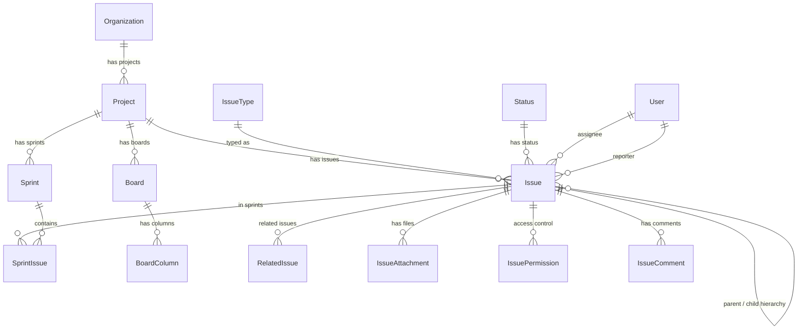
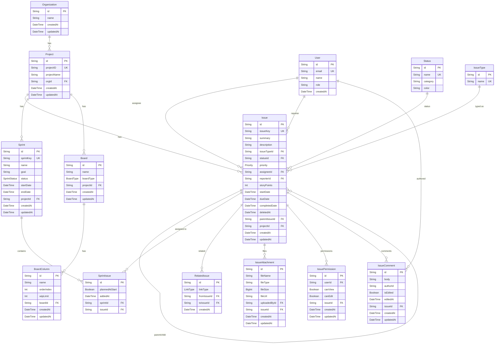

# FlowDesk — Create Task Feature: Database Schema (v3 — Final Production Ready)

> Workspace Tab: **Create Task**
> Proposed Date: **March 27, 2026**
> Updated: **March 27, 2026** — v3: Production hardening per manager review
> ⚠️ This is a PLANNING document only. No changes made to current schema.

---

## 🔥 What Changed from v1 (Key Decisions)

| v1 (Wrong) | v2 | v3 (Final) |
|---|---|---|
| 3 separate tables: `epics`, `user_stories`, `tasks` | Single `issues` table (Jira-style) | ✅ Kept |
| `tasks.sprintId` direct FK | Many-to-many via `sprint_issues` | ✅ Kept |
| `status VARCHAR` in tasks | `IssueStatus` enum in `issues` | `statusId FK` → `statuses` table (flexible, migration-free) |
| Hardcoded issue types | `issue_types` table | ✅ Kept |
| No `boards` / `board_columns` | Added for Kanban/Scrum | ✅ Kept + `@@unique([boardId, name])` added |
| `task_assignees` separate table | `assigneeId` in `issues` | ✅ + FK → `users` table |
| `issue_links` table | Renamed to `related_issues` | ✅ + `@@unique([fromIssueId, toIssueId, linkType])` |
| No comments | `issue_comments` added | ✅ Kept |
| No User model | — | `users` model added with FK relations |
| No Project model in schema | — | `Project` model added |
| No soft delete | — | `deletedAt DateTime?` on `issues` |
| Missing composite indexes | — | `@@index([projectId, status])` + `@@index([assigneeId, status])` |

---

## 1. Final Architecture (Manager Approved)

```
Organization (optional — multi-tenant)
   └── Project
         ├── Issues  (Epic / Story / Task / Bug / Sub-task — single table)
         │     └── self-hierarchy via parent_issue_id
         ├── Boards  (SCRUM / KANBAN)
         │     └── Board Columns  (To Do / In Progress / Done + WIP limit)
         └── Sprints
               └── Sprint_Issues  (many-to-many)
```

> ⚠️ BIGGEST CHANGE: No more `epics` / `user_stories` tables.
> Everything is ONE `issues` table with `issue_type` + `parent_issue_id`.

---

## 2. Tables — Final List

| Table | Status | Purpose |
|---|---|---|
| `issues` | 🆕 New (replaces `tasks`) | Central table — Epic / Story / Task / Bug / Sub-task |
| `issue_types` | 🆕 New | Lookup: Epic, Story, Task, Bug, Sub-task |
| `statuses` | 🆕 New | Flexible status lookup (To Do / In Progress / Done / custom) |
| `users` | 🆕 New | User model for FK integrity on assignee/reporter/author |
| `sprints` | 🆕 New | Sprint definitions per project |
| `sprint_issues` | 🆕 New | Many-to-many: sprint ↔ issue |
| `boards` | 🆕 New | Kanban / Scrum board per project |
| `board_columns` | 🆕 New | Columns of a board (with WIP limit + unique name per board) |
| `related_issues` | 🆕 New | blocks / relates-to / duplicates (unique constraint added) |
| `issue_attachments` | 🆕 New | Files per issue |
| `issue_permissions` | 🆕 New | View / Edit access per user per issue |
| `issue_comments` | 🆕 New | Comments / discussion thread per issue |
| `organizations` | 🆕 New (optional) | Multi-tenant support |

### ❌ REMOVED from v1

| Removed | Reason |
|---|---|
| `epics` | Merged into `issues` (issue_type = 'Epic') |
| `user_stories` | Merged into `issues` (issue_type = 'Story') |
| `task_assignees` table | Replaced by `assigneeId` FK → `users` in `issues` |
| `tasks.sprintId` direct FK | Replaced by `sprint_issues` (many-to-many) |
| `IssueStatus` enum | Replaced by `statuses` table — supports custom statuses without migration |

---

## 3. Full Proposed Prisma Schema (v2)

> ⚠️ Do NOT run this yet. For planning only.

```prisma
// ============================================
// ENUMS
// ============================================

enum Priority {
  high
  medium
  low
}

enum BoardType {
  SCRUM
  KANBAN
}

enum SprintStatus {
  upcoming
  active
  completed
}

enum LinkType {
  blocks
  isBlockedBy
  relatesTo
  duplicates
}

// ============================================
// USERS — FK integrity for assignee/reporter/author
// ============================================

model User {
  id           String   @id @default(uuid())
  email        String   @unique
  name         String
  passwordHash String
  role         String   @default("member") // 'admin' / 'member'
  createdAt    DateTime @default(now())
  updatedAt    DateTime @updatedAt

  assignedIssues   Issue[]        @relation("IssueAssignee")
  reportedIssues   Issue[]        @relation("IssueReporter")
  comments         IssueComment[]
  attachments      IssueAttachment[]
  permissions      IssuePermission[]

  @@index([email])
  @@map("users")
}

// ============================================
// STATUSES — Flexible lookup (custom statuses without migration)
// ============================================

model Status {
  id       String @id @default(uuid())
  name     String @unique  // 'To Do' / 'In Progress' / 'In Review' / 'Done' / 'Blocked' / custom
  category String          // 'todo' / 'in-progress' / 'done'
  color    String @default("#94a3b8")

  issues   Issue[]

  @@map("statuses")
}

// ============================================
// ORGANIZATIONS — Multi-tenant (optional)
// ============================================

model Organization {
  id        String    @id @default(uuid())
  name      String
  createdAt DateTime  @default(now())
  updatedAt DateTime  @updatedAt

  projects  Project[]

  @@map("organizations")
}

// ============================================
// PROJECT — Core entity
// ============================================

model Project {
  id          String   @id @default(uuid())
  projectID   String   @unique   // e.g. FD, PRJ-001
  projectName String
  orgId       String?
  org         Organization? @relation(fields: [orgId], references: [id])

  issues      Issue[]
  sprints     Sprint[]
  boards      Board[]

  createdAt   DateTime @default(now())
  updatedAt   DateTime @updatedAt

  @@index([orgId])
  @@map("projects")
}

// ============================================
// ISSUE TYPES — Epic / Story / Task / Bug / Sub-task
// ============================================

model IssueType {
  id   String @id @default(uuid())
  name String @unique  // 'Epic' / 'Story' / 'Task' / 'Bug' / 'Sub-task'

  issues Issue[]

  @@map("issue_types")
}

// ============================================
// ISSUES — Central table (replaces tasks, epics, user_stories)
// ============================================

model Issue {
  id          String    @id @default(uuid())
  issueKey    String    @unique   // e.g. FD-001, FD-002 (project key + number)
  summary     String              // title / name
  description String?

  // Type (FK lookup)
  issueTypeId String
  issueType   IssueType  @relation(fields: [issueTypeId], references: [id])

  // Status (FK lookup — flexible, supports custom statuses)
  statusId    String
  status      Status     @relation(fields: [statusId], references: [id])

  // Priority
  priority    Priority  @default(medium)

  // Ownership — FK to users table
  assigneeId  String?
  assignee    User?     @relation("IssueAssignee", fields: [assigneeId], references: [id])
  reporterId  String?
  reporter    User?     @relation("IssueReporter", fields: [reporterId], references: [id])

  // Effort
  storyPoints Int?

  // Timeline
  startDate     DateTime?
  dueDate       DateTime?
  completedDate DateTime?

  // Soft delete (production safety — data recoverable)
  deletedAt     DateTime?

  // Hierarchy — self-reference (Epic → Story → Task → Sub-task)
  parentIssueId String?
  parentIssue   Issue?  @relation("IssueHierarchy", fields: [parentIssueId], references: [id])
  childIssues   Issue[] @relation("IssueHierarchy")

  // Project FK
  projectId   String
  project     Project   @relation(fields: [projectId], references: [id], onDelete: Cascade)

  // Relations
  sprints         SprintIssue[]
  attachments     IssueAttachment[]
  permissions     IssuePermission[]
  comments        IssueComment[]
  relatedFrom     RelatedIssue[] @relation("RelatedFrom")
  relatedTo       RelatedIssue[] @relation("RelatedTo")

  createdAt   DateTime  @default(now())
  updatedAt   DateTime  @updatedAt

  @@index([projectId])
  @@index([statusId])
  @@index([issueTypeId])
  @@index([parentIssueId])
  @@index([assigneeId])
  @@index([dueDate])
  @@index([projectId, statusId])   // composite: dashboard filter
  @@index([assigneeId, statusId])  // composite: my issues filter
  @@map("issues")
}

// ============================================
// SPRINTS — Agile sprints per project
// ============================================

model Sprint {
  id        String   @id @default(uuid())
  sprintKey String   @unique   // e.g. SPR-001
  name      String             // e.g. "Sprint 1"
  goal      String?
  status    SprintStatus @default(upcoming)
  startDate DateTime?
  endDate   DateTime?

  projectId String
  project   Project  @relation(fields: [projectId], references: [id], onDelete: Cascade)

  issues    SprintIssue[]

  createdAt DateTime @default(now())
  updatedAt DateTime @updatedAt

  @@index([projectId])
  @@map("sprints")
}

// ============================================
// SPRINT_ISSUES — Many-to-many: Sprint ↔ Issue
// ============================================

model SprintIssue {
  id             String   @id @default(uuid())
  plannedAtStart Boolean  @default(true)  // false = scope creep
  addedAt        DateTime @default(now())

  sprintId String
  sprint   Sprint @relation(fields: [sprintId], references: [id], onDelete: Cascade)

  issueId  String
  issue    Issue  @relation(fields: [issueId], references: [id], onDelete: Cascade)

  @@unique([sprintId, issueId])
  @@index([sprintId])
  @@index([issueId])
  @@map("sprint_issues")
}

// ============================================
// BOARDS — Kanban / Scrum board per project
// ============================================

model Board {
  id        String   @id @default(uuid())
  name      String
  boardType BoardType @default(KANBAN)

  projectId String
  project   Project  @relation(fields: [projectId], references: [id], onDelete: Cascade)

  columns   BoardColumn[]

  createdAt DateTime @default(now())
  updatedAt DateTime @updatedAt

  @@index([projectId])
  @@map("boards")
}

// ============================================
// BOARD_COLUMNS — Columns of a board
// ============================================

model BoardColumn {
  id         String @id @default(uuid())
  name       String   // e.g. "To Do", "In Progress", "Done"
  orderIndex Int      // display order
  wipLimit   Int?     // Work In Progress limit (Kanban)

  boardId    String
  board      Board  @relation(fields: [boardId], references: [id], onDelete: Cascade)

  createdAt  DateTime @default(now())
  updatedAt  DateTime @updatedAt

  @@index([boardId])
  @@unique([boardId, name])   // no duplicate column names per board
  @@map("board_columns")
}

// ============================================
// RELATED_ISSUES — blocks / relates-to / duplicates
// ============================================

model RelatedIssue {
  id       String   @id @default(uuid())
  linkType LinkType

  fromIssueId String
  fromIssue   Issue  @relation("RelatedFrom", fields: [fromIssueId], references: [id], onDelete: Cascade)

  toIssueId   String
  toIssue     Issue  @relation("RelatedTo", fields: [toIssueId], references: [id], onDelete: Cascade)

  createdAt   DateTime @default(now())

  @@index([fromIssueId])
  @@index([toIssueId])
  @@unique([fromIssueId, toIssueId, linkType])  // no duplicate relations
  @@map("related_issues")
}

// ============================================
// ISSUE_ATTACHMENTS — Files per issue
// ============================================

model IssueAttachment {
  id         String   @id @default(uuid())
  fileName   String
  fileType   String   // MIME type e.g. "image/png", "application/pdf"
  fileSize   BigInt   // bytes — BigInt supports files > 2GB
  fileUrl    String   // storage URL or local path

  uploadedById String
  uploadedBy   User   @relation(fields: [uploadedById], references: [id])

  issueId    String
  issue      Issue    @relation(fields: [issueId], references: [id], onDelete: Cascade)

  createdAt  DateTime @default(now())
  updatedAt  DateTime @updatedAt

  @@index([issueId])
  @@map("issue_attachments")
}

// ============================================
// ISSUE_PERMISSIONS — View / Edit access
// ============================================

model IssuePermission {
  id      String  @id @default(uuid())
  canView Boolean @default(true)
  canEdit Boolean @default(false)

  userId  String
  user    User   @relation(fields: [userId], references: [id])

  issueId String
  issue   Issue  @relation(fields: [issueId], references: [id], onDelete: Cascade)

  createdAt DateTime @default(now())
  updatedAt DateTime @updatedAt

  @@unique([issueId, userId])
  @@index([issueId])
  @@map("issue_permissions")
}

// ============================================
// ISSUE_COMMENTS — Discussion thread per issue
// ============================================

model IssueComment {
  id       String  @id @default(uuid())
  body     String                     // comment text (supports markdown)

  authorId String
  author   User   @relation(fields: [authorId], references: [id])

  // Edit tracking
  isEdited  Boolean  @default(false)
  editedAt  DateTime?

  issueId String
  issue   Issue  @relation(fields: [issueId], references: [id], onDelete: Cascade)

  createdAt DateTime @default(now())
  updatedAt DateTime @updatedAt

  @@index([issueId])
  @@index([authorId])
  @@map("issue_comments")
}
```

---

## 4. ER Diagram — High Level



---

## 5. ER Diagram — Detailed (With All Columns)



---

## 6. Requirements → Table Mapping

| Section | Requirement | Field / Table |
|---|---|---|
| 4.1 | Summary (Title) | `issues.summary` |
| 4.1 | Description | `issues.description` |
| 4.2 | Assignee | `issues.assigneeId` |
| 4.2 | Reporter | `issues.reporterId` |
| 4.3 | Due Date | `issues.dueDate` |
| 4.3 | Start Date | `issues.startDate` |
| 4.3 | Sprint | `sprint_issues` (many-to-many) |
| 4.3 | Story Points | `issues.storyPoints` |
| 4.4 | Status (default: To Do) | `issues.statusId` → `statuses` table |
| 4.5 | Priority (High/Medium/Low) | `issues.priority` |
| 4.6 | Related Issues | `related_issues.linkType` |
| 4.6 | Parent / Sub-task | `issues.parentIssueId` (self-ref) |
| 4.6 | Epic Link | `issues.parentIssueId` where parent `issueType = Epic` |
| 4.7 | File Attachments | `issue_attachments` |
| 4.8 | View / Edit Permissions | `issue_permissions.canView` / `canEdit` |
| — | Issue Key generation | `issues.issueKey` = `{projectID}-{autoincrement}` e.g. FD-001 |
| — | Soft delete | `issues.deletedAt` (null = active, set = deleted) |
| — | Issue Type | `issues.issueTypeId` → `issue_types` |
| — | Board Layout | `boards` + `board_columns` |
| — | Scope creep tracking | `sprint_issues.plannedAtStart` |

---

## 7. Cascade Delete Chain

```
Organization
  └── Project
        ├── Issues
        │     ├── child issues (self-ref, NOT cascade — orphan or reassign)
        │     ├── sprint_issues     → deleted
        │     ├── related_issues    → deleted
        │     ├── issue_attachments → deleted
        │     ├── issue_permissions → deleted
        │     └── issue_comments    → deleted
        ├── Sprints
        │     └── sprint_issues → deleted
        └── Boards
              └── board_columns → deleted

Note: Users are NOT cascade-deleted — they are independent entities.
Soft deleted issues (deletedAt ≠ null) are excluded from queries but not removed from DB.
```

---

## 8. Migration Plan (When Ready)

```bash
# This will be Migration #4 in FlowDesk PostgreSQL history
npx prisma migrate dev --name add_issues_sprints_boards_v2
npx prisma generate
```

> **Before running:** Update `backend/prisma/schema.prisma` with all models above.
> **After running:** Update `DATABASE.md` — bump total tables from 10 → 20 and add migration entry.

---

## 9. Seed Data Required (issue_types + statuses)

```ts
// issue_types
await prisma.issueType.createMany({
  data: [
    { name: 'Epic' },
    { name: 'Story' },
    { name: 'Task' },
    { name: 'Bug' },
    { name: 'Sub-task' },
  ]
});

// statuses (flexible — can add custom ones without migration)
await prisma.status.createMany({
  data: [
    { name: 'To Do',                category: 'todo',        color: '#94a3b8' },
    { name: 'In Progress',          category: 'in-progress', color: '#3b82f6' },
    { name: 'In Review',            category: 'in-progress', color: '#f59e0b' },
    { name: 'Done',                 category: 'done',        color: '#22c55e' },
    { name: 'Blocked',              category: 'todo',        color: '#ef4444' },
  ]
});

// Issue key generation logic (application layer)
// issueKey = `${project.projectID}-${autoincrement}`
// e.g. FD-001, FD-002, FD-003...
// Implement as: count existing issues per project + 1
```
