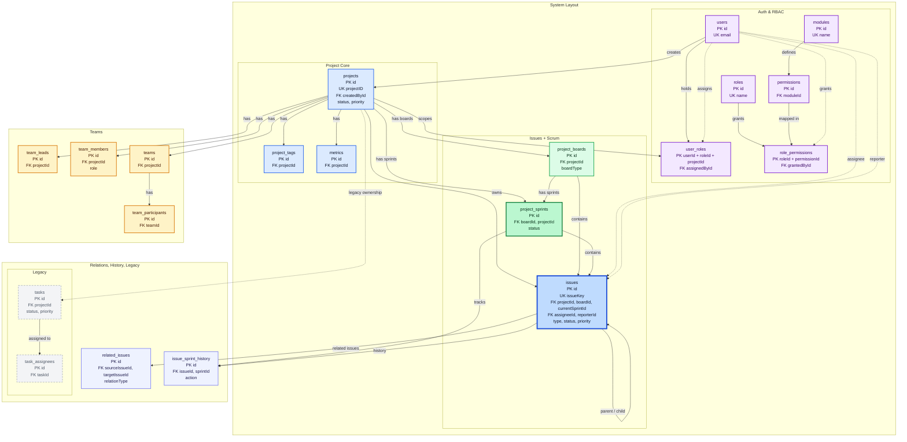

# FlowDesk - Clean ER Diagram

Derived from the schema documented in scrum-schema1.md.

## 1. Clean Layout Description

- Left: Auth & RBAC is grouped together so identity, permission, and assignment flows are easy to trace from users to roles, permissions, and project-scoped role bindings.
- Center: Project Core is the anchor of the system. projects sits in the middle because it is the main ownership boundary for tags, metrics, teams, issues, boards, sprints, and legacy tasks.
- Lower center: Teams is separated as its own domain directly under Project Core so team-specific tables stay readable without mixing into RBAC or Issues.
- Right: Issues and Scrum are placed together because boards, sprints, and issues form the primary work-management flow.
- Bottom: related_issues and issue_sprint_history are placed below the active work area because they are supporting relationship and audit tables, not primary entry points.
- Bottom right: Legacy tables are isolated and visually de-emphasized so they remain documented without competing with the active architecture.

## 2. Improved ER Diagram

This diagram uses Mermaid flowchart styling instead of Mermaid erDiagram syntax so domain grouping, color coding, and layout control stay presentation-ready while preserving the same entities and relationships.

## 3. Visual Design Rules Applied

- Domain grouping: Each table is placed in one business domain only, which reduces context switching and makes ownership boundaries obvious.
- Core emphasis: projects and issues use stronger blue styling because they are the two main anchors of the system.
- Scrum emphasis: project_boards and project_sprints use green styling and stay adjacent to issues so the delivery flow reads left-to-right and top-to-bottom.
- RBAC clarity: users, roles, permissions, modules, and the join tables stay on the left so access-control logic is separated from delivery logic.
- Team separation: team_leads, team_members, teams, and team_participants are grouped below the project core to show they are project-owned but domain-specific.
- Supporting tables reduced in weight: related_issues and issue_sprint_history are moved to the bottom because they support the main workflow rather than define it.
- Legacy isolation: tasks and task_assignees remain in the diagram but use muted grey and dashed styling to indicate deprecated status.
- Relationship labels normalized: Labels such as has, owns, contains, scopes, assignee, reporter, related issues, and assigned to replace vague wording.
- Column simplification: Only PKs, FKs, unique identifiers, and key state columns are shown so the diagram stays readable in under 30 seconds.
- Line optimization: The layout uses projects as the center anchor and issues as the right-side anchor, which shortens the highest-volume relationship paths and reduces crossings.

## Notes

- No entities were removed.
- No relationships were removed.
- No schema logic was changed.
- This is a presentation-oriented ER view of the same architecture already described in scrum-schema1.md.